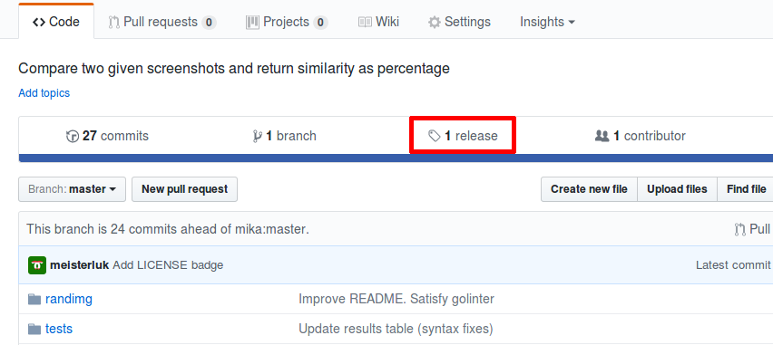
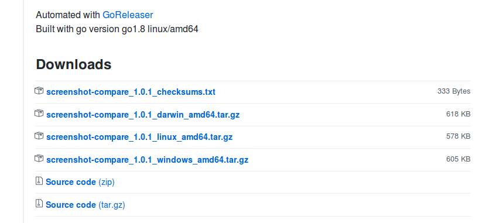
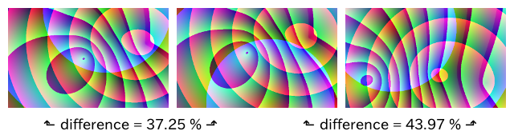
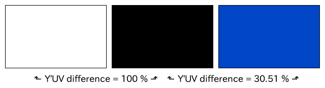
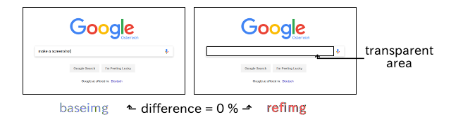

README
======

link:https://img.shields.io/github/release/GrmlForensic/screenshot-compare.svg?style=flat-square[image:https://img.shields.io/github/release/GrmlForensic/screenshot-compare.svg?style=flat-square[Latest version]]
link:https://godoc.org/github.com/GrmlForensic/screenshot-compare[image:https://godoc.org/github.com/GrmlForensic/screenshot-compare?status.svg[GoDoc]]
link:LICENSE[image:https://img.shields.io/badge/license-MIT-brightgreen.svg?style=flat-square[Used LICENSE]]
link:https://travis-ci.org/GrmlForensic/screenshot-compare[image:https://api.travis-ci.org/GrmlForensic/screenshot-compare.svg?branch=master[travis test result]]
link:https://goreportcard.com/report/github.com/GrmlForensic/screenshot-compare[image:https://goreportcard.com/badge/github.com/GrmlForensic/screenshot-compare[Go Report Card]]

author::
  grml solutions
version::
  1.2.0
gonamespace (API)::
  scmp "github.com/GrmlForensic/screenshot-compare/v1"
gonamespace (CLI)::
  github.com/GrmlForensic/screenshot-compare/cli

What is it about?
-----------------

You can compare two image files and it will show a difference score between 0 and 1.
Using transparent reference PNG images, you can also skip certain areas of the file.
Unlike the title, you can compare arbitrary images, but our usecase is screenshot comparison.

You can either get the binary executable or use this implementation as a go dependency.

Why should I use it?
--------------------

We take screenshots of running live systems and want to know, whether they are (visually) in a certain state.

Who should use it?
------------------

Especially software developers testing software might find this software useful.
Consider that modern browsers feature headless modes (e.g. link:https://developer.mozilla.org/en-US/Firefox/Headless_mode[Mozilla Firefox], link:https://developers.google.com/web/updates/2017/04/headless-chrome[Google Chrome]).
With this feature it will be easy to take screenshots of websites and this project enables you to compare them.
Thus, web developers might find it useful as well.
We use it in combination with virtualization software.

How to install
--------------

You can run `go get`:

[source,bash]
go get github.com/GrmlForensic/screenshot-compare/...

and start developing! 😊 You can build the executable using:

[source,base]
go build -o screenshot-compare github.com/GrmlForensic/screenshot-compare/cli

How to run
----------

1. Go to https://github.com/GrmlForensic/screenshot-compare
2. Click on the Releases link
   
3. Scroll down, choose the download appropriate for your platform
   
4. Once the download has finished, extract the files of the tar-gz archive
5. Run the file screenshot-compare on the Terminal (cmd.exe or PowerShell for Windows users)
   

One terminal example is the comparison of link:tests/grml_booting_totalmemory_kB.png[`grml_booting_totalmemory_kB.png`] and link:tests/grml_booting_totalmemory_MB.png[`grml_booting_totalmemory_MB.png`]:

[code,bash]
----
$ ./screenshot-compare tests/grml_booting_totalmemory_kB.png tests/grml_booting_totalmemory_MB.png 
runtime:                372.624129ms
timeout:                false
pixels different:       168
difference percentage:  0.017 %
----

The exit code also shows the difference percentage.
Run `screenshot-compare` without arguments to see the usage description for this.

How to call
-----------

You can call the main routine `Compare` programmatically. Either you look into the `cli/` or `tests/` directories for examples or take a look at this example:

[source,go]
----
package main

import (
    "fmt"

    scmp "github.com/GrmlForensic/screenshot-compare/v1"
)

func main() {
    config := scmp.NewConfig()
    result := scmp.Result{}

    // prepare images for comparison
    err := config.BaseImg.FromFilepath("image1.png")
    if err != nil {
        panic(err)
    }
    err = config.RefImg.FromFilepath("image2.png")
    if err != nil {
        panic(err)
    }

    // run comparison
    err = scmp.Compare(config, &result)
    if err != nil {
        panic(err)
    }

    // show score
    fmt.Println(result.Score)
}
----

As you can see, I bound the `v1` API import to the alias `scmp` which is best practice.

Understanding the score
-----------------------

* If the dimensions of the two images do not correspond, we reject.
* We look at every individual pixel and determine a difference value between 0 and 1 based on the color.
* We multiply the difference value by the alpha channel value of the reference image.
* We evaluate the average over all pixels of the image. This is our image difference score.

White and black provides the hugest difference (though 100% is not limited to black/white):

These `randimg` images use similar colors, but the structures are slightly (left) or vastly (right) translated.

If you use the `Y'UV` color space, the score slightly changes (RGB provided 59.7% for black/blue):

This image illustrates the transparency feature:

`PNG` and `JPEG` file formats can be processed.
If you want a binary classifier whether the images are similar,
`0.1` (i.e. `10%`) might be a suitable classifier.

Source Code
-----------

The source code is available at link:https://github.com/GrmlForensic/screenshot-compare[Github].

License
-------

See link:LICENSE[the LICENSE file] (Hint: MIT license).

Changelog
---------

0.0.1::
  first release: PNG only, transparency support
0.0.2::
  goroutine support, timeout argument, slight performance improvement
1.0.0::
  complete rewrite, `--wait` and `--timeout` parameters, `Y'UV` support
1.0.1::
  improved README with illustrations
1.0.2::
  introduce README section "How to run"
1.1.0::
  complete rewrite of the core with same functionality +
  allows to retrieve config from env vars, JSON file and CLI args +
  result shows the number of pixels with differences +
  public API / implementation as a library +
  source code was moved into v1 module to allow usage in a backwards-compatible way
1.2.0::
  switch from meisterluk to GrmlForensic namespace +
  add goreleaser configuration file

Issues
------

Please report any issues on the link:https://github.com/GrmlForensic/screenshot-compare/issues[Github issues page].
